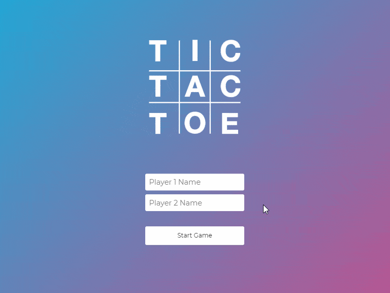

<p align="center">
  <a href="https://winoapp.herokuapp.com">
    
  </a>
</p>
<div align="center">
  <h1>Tic-Tac-Toe</h1>
  <h3>The classic pencil-and-paper game written for the browser in HTML, CSS, and vanilla JavaScript.</h3>
</div>

## About Tic-Tac-Toe

Tic-tac-toe is a game in which two players alternately put Xs and Os within squares. The objective of the game is to get a row of three Xs or three Os before the opponent does.

## App Preview

<div align="center">
  
</div>

## To Set Up Locally

You can take all the files of this site and run them on your computer as if it were live online, only it's just on your machine.

### Requirements

* [Git](http://git-scm.com/)

To copy the repository's files from here onto your computer and to view and serve those files locally, at your computer's command line type:
```
git clone https://github.com/mvrad/tic-tac-toe.git
```

## View Project

To view the app online, visit [this link](https://mvrad.github.io/tic-tac-toe/).